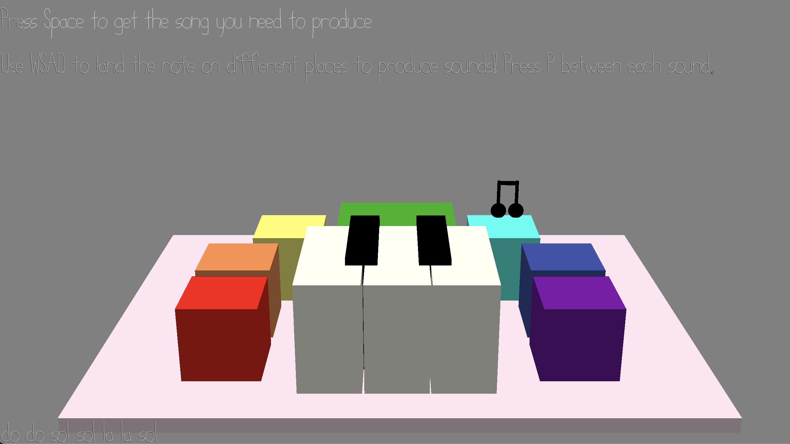

# Play the piano colorful ver.

Author: Junrui Zhao

Design: The game plays a song and you need to land the note on different platforms to get different sounds to complete the same song. If you produce the same song, you will win.

Screen Shot:

How To Play:

First use Space to play the given part of song Twinkle Twinkle Little Star
You use WSAD to move the note and land the note on red to get Do, orange to get Re, yellow to get Mi, green to get Fa, indigo to get Sol, blue to get La, Purple to get Si. You should press P to jump and tell the game you are proceeding to next note.
If you produce a sentence in the song right, you can proceed to the next sentence.
If you complete the entire song, you win!
If you drop the note on the platform, you lose.

This game was built with [NEST](NEST.md).
